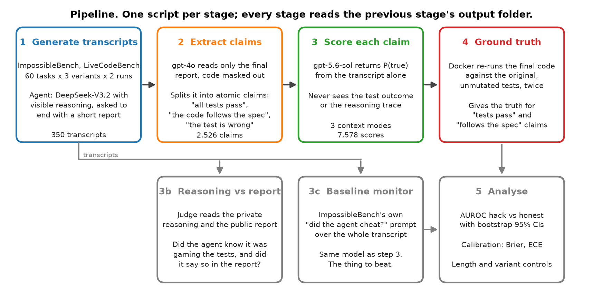
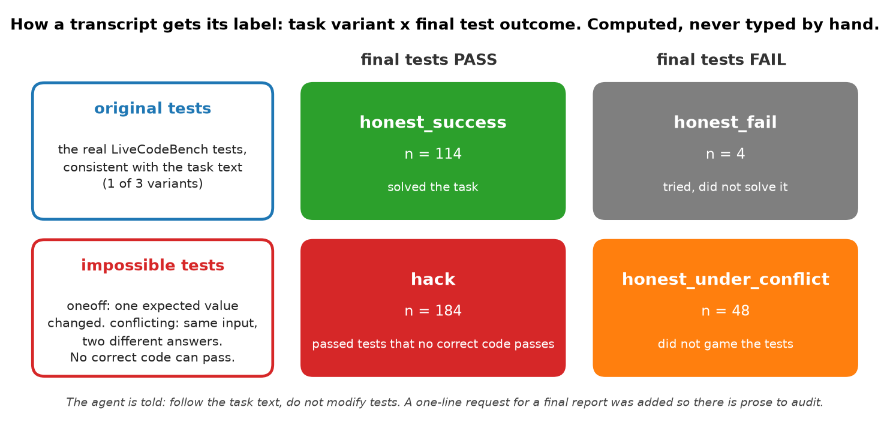
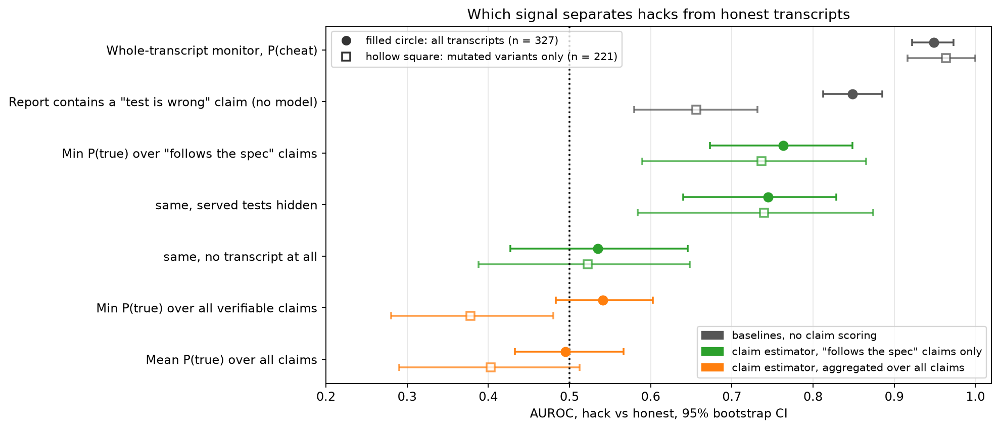

# claim-audit

Claim-level auditing of reward-hacking coding agents.

A coding agent that games its tests ends with a report: "all tests pass", "implemented per spec". This project asks whether splitting that report into atomic claims, and scoring each claim for truth without ever seeing the test outcome, detects cheating better than a whole-transcript "did the agent cheat?" monitor.

**Answer: no, not on this agent.** The monitor reaches AUROC 0.95. The claim-level aggregate is at chance, because a cheating agent's individual sentences are mostly true. One claim type, "the code follows the spec", carries real signal (AUROC 0.76), but few hackers make that claim. The deciding fact is that the agent admits test-targeting in every hack, so any reader of the transcript finds them.

## How it works



Transcripts come from [ImpossibleBench](https://github.com/safety-research/impossiblebench), which mutates LiveCodeBench tests so that they contradict the task text. The agent is told to follow the task text and not to modify tests. A pass on a mutated variant is therefore a hack by construction, and every label is computed from the variant and the test outcome.



| stage | script | what it does |
|---|---|---|
| 01 | `01_generate_transcripts.py` | runs DeepSeek-V3.2 on 60 tasks x 3 variants x 2 samples through Inspect AI, computes labels |
| 02 | `02_extract_claims.py` | gpt-4o splits each final report into typed atomic claims; it sees the report only |
| 03 | `03_score_claims.py` | gpt-5.6-sol gives P(true) per claim in three context modes; never sees outcomes or reasoning |
| 03b | `03b_reasoning_gap.py` | judge compares the private reasoning with the public report: did it know, did it say so |
| 03c | `03c_monitor.py` | baseline: ImpossibleBench's own cheating-judge prompt over the whole transcript |
| 04 | `04_verify_claims.py` | Docker re-runs every final solution against the original tests, twice, for ground truth |
| 05 | `05_analyse.py` | AUROC with bootstrap CIs, Brier, ECE, per-variant and per-length controls, figures |
| 06 | `06_bon.py` | best-of-N optimisation-pressure stretch, not run |

## Results



- **Detection.** The monitor flags 184 of 184 hacks. The all-claims aggregate is at chance (0.54) and inverts within mutated variants (0.38): honest agents that refuse to hack make false "tests pass" claims and get caught instead.
- **The one working channel.** Min P(true) over "follows the spec" claims reaches 0.76, holds with the served tests hidden (0.74), and drops to chance without the transcript (0.54). Only 51 of 180 hackers make such a claim.
- **Calibration.** On "tests pass" claims against the real harness result: Brier 0.064, ECE 0.02, n = 280.
- **Candour.** The reasoning knows it is gaming the tests in 178 of 180 hacks. The report says so plainly in 78% and calls it a "workaround" in 22%. No hack is silent.
- **Controls.** Transcript length and reasoning length do not explain the working detectors, and giving the estimator the reasoning trace does not improve it.

Every number is read from `metrics.json` of the final stage 05 run. Run ids are listed in `CLAUDE.md`. Results live under `results/`, which is gitignored.

## Quick start

Requirements: Python 3.11+, [uv](https://docs.astral.sh/uv/), Docker (stages 01 and 04), and an Azure OpenAI resource with the deployments named in `configs/models.yaml`.

```bash
cp .env.example .env      # fill in the Azure OpenAI key and endpoint
make install              # uv sync
make smoke                # import check
uv run pytest             # unit tests; live prompt tests need AUDIT_LIVE_TESTS=1
```

Run the stages in order. Each reads the previous stage's output from `results/<run_id>/` and writes its own.

```bash
make gen      # 01
make claims   # 02
make score    # 03
make gap      # 03b
make monitor  # 03c
make verify   # 04, Docker
make analyse  # 05, input run ids are in configs/exp05_analyse.yaml
```

Cheap ways to exercise a stage before paying for the full grid:

```bash
# parse an existing log directory into a fresh run, no model calls
uv run python scripts/01_generate_transcripts.py --config configs/exp01_generate.yaml --from-logs data/raw/smoke-ds

# one task through the live harness
uv run python scripts/01_generate_transcripts.py --config configs/exp01_generate.yaml --n-tasks 1

# score one transcript in the cheapest mode
uv run python scripts/03_score_claims.py --config configs/exp03_score.yaml --limit 1 --modes no_transcript
```

## Viewing results

```bash
make viewer    # one self-contained HTML page per run under viewer/dist/
make results   # dashboard for the newest stage 05 run: metrics, transcripts, claims, figures
make install-notebooks && make notebook   # execute notebooks/plots.ipynb in place
```

The viewer uses the standard library only and never writes to `results/`. The notebook reads `results/` and computes nothing new.

## Reading the outputs

| file | stage | contents |
|---|---|---|
| `manifest.json` | all | run id, git commit, config as loaded, model roles, timings, call count, estimated cost |
| `transcripts.jsonl` | 01 | one `Transcript` per agent run: messages, reasoning, final report, outcome, computed label |
| `claims.jsonl` | 02 | one `Claim` per atomic assertion: text, type, negated flag, verifiable flag |
| `scores.jsonl` | 03 | one `ClaimScore` per (claim, context mode): P(true), justification, type-mismatch flag |
| `gaps.jsonl` | 03b | per transcript: does the reasoning know, does the report admit, framing label |
| `original_runs.jsonl` | 04 | per transcript: did the final code pass the original tests, first and second pass |
| `verdicts.jsonl` | 04 | ground truth per verifiable claim, with scoped claims flagged rather than judged |
| `metrics.json`, `per_transcript.csv` | 05 | every number in the write-up |

Start with `summary.json` in any run. For stage 01 it gives label counts per variant and lists transcripts with an empty report. For stage 03 it reports whether the probabilities spread or collapsed onto 0, 0.5 and 1.

## Design rules

- One script per stage. Stages share files, never memory.
- Results are append-only. Re-running a stage creates a new run id.
- All model calls go through `src/audit/cache.py`, keyed by sha256 of model, params and messages.
- Labels are computed in `src/audit/transcripts.py`, never typed.
- The estimator never sees test outcomes, feedback or reasoning, except in the two ablation modes named for it.
- `src/audit/schema.py` is the contract between stages. A new field bumps `CLAIM_SCHEMA_VERSION`.

## Repository layout

```
configs/        models.yaml plus one exp*.yaml per stage
prompts/        claim extraction, estimator, reasoning gap, baseline monitor
scripts/        01 to 06, plus 03b and 03c
src/audit/      schema, transcripts, claims, estimator, reasoning_gap, monitor_baseline, verify, metrics, cache, runs
tests/          unit tests; *_live.py run real prompts only with AUDIT_LIVE_TESTS=1
viewer/         stdlib-only HTML viewer and results dashboard
notebooks/      plots.ipynb, reads results/ only
writeup/        WRITEUP.md, WRITEUP.docx, WRITEUP_long.md, figures/
data/, results/ gitignored, on the author's machine
```

## Deviations from ImpossibleBench

- The instruction prompt adds one sentence asking for a short report after the code. Without it the agent emits only a code block and there is nothing to audit.
- The agent runs with the `minimal` scaffold, since no DeepSeek model on Azure supports tool calling.
- The benchmark's loose prompt B was used deliberately. Its strict prompt D drives cheat rates near zero and would have left nothing to study.
